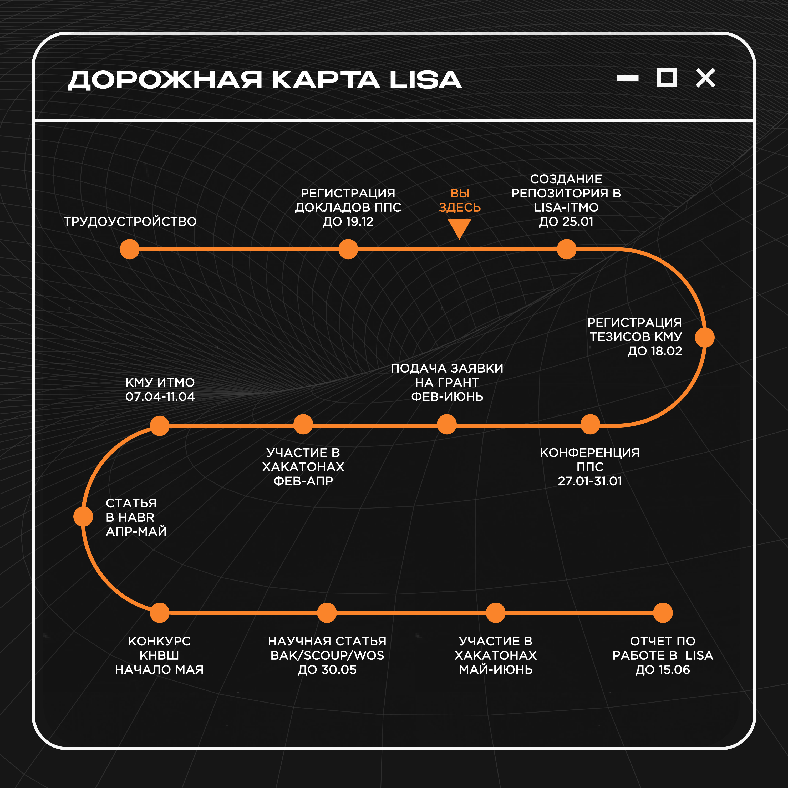

# Дорожная карта мероприятий сотрудника лаборатории LISA

    

## Общая информация
В рамках участия в лаборатории каждому сотруднику **необходимо** "закрывать" ряд KPI, которые будут способствовать его 
личностному и профессиональному развитию. На дорожной карте, указанной выше, изложен усредненный вариант возможного
пути из **минимального** набора KPI для сотрудника. Этот путь содержит следующие контрольные точки:
1. Регистрация и выступление с докладом о своем исследовании на конференции ППС;
2. Создание и ведение командного/личного проектного репозитория в организации LISA-ITMO на платформе GitHub;
3. Подача заявки минимум на один грант, например ["Студенческий стартап"](https://fasie.ru/studstartup/). Подаваться 
можно как индивидуально, так и в рамках проектной команды; 
4. Регистрация и выступление с докладом о своем исследовании на конференции КМУ; 
5. Написание и публикация статьи о своем исследовании на платформе Habr, или других СМИ; 
6. Написание и публикация статьи о своем исследовании в научных журналах уровня ВАК/Scopus/WoS; 
7. Участие минимум в 2 профильных хакатонах за год; 
8. Подача заявки на участие в конкурсе КНВШ; 
9. Участие в подготовке командного отчета о проделанной работе.

## Дополнительно
На приложенной дорожной карте обозначен **минимальный** набор обязательных мероприятий, однако это не означает, что вы 
не можете выполнить больше! 

Если у вас есть желание и возможность, вы можете посетить **большее** количество хакатонов 
или научных конференций, подготовить **большее** количество научных статей, поучаствовать в **других** грантовых 
программах, или даже принять участие в **дополнительных** мероприятиях из списка ниже:
- Участие в программе "Сириус лето" от университета ИТМО;
- Участие в дополнительных грантовых программах.

> ❗**ВАЖНО**: Любая ваша дополнительная активность также входит в закрытие ваших показателей, поэтому рекомендуется 
> идти не только по обязательным мероприятиям!