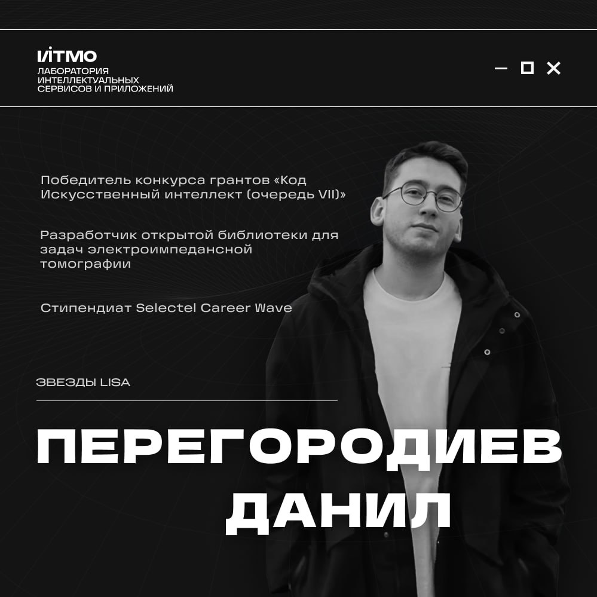
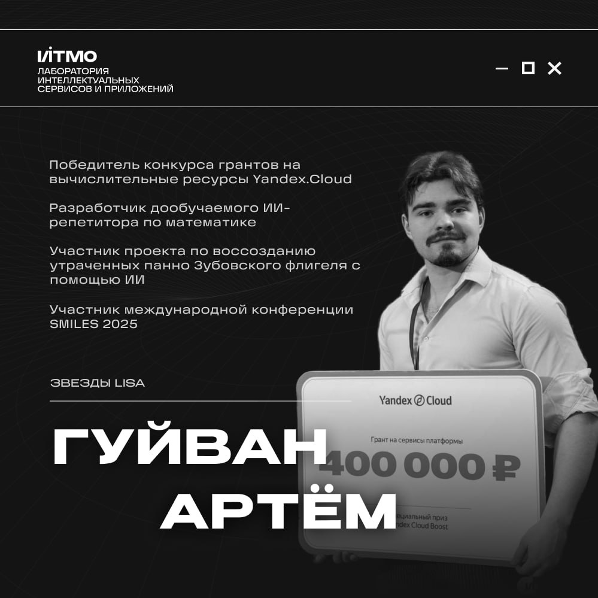
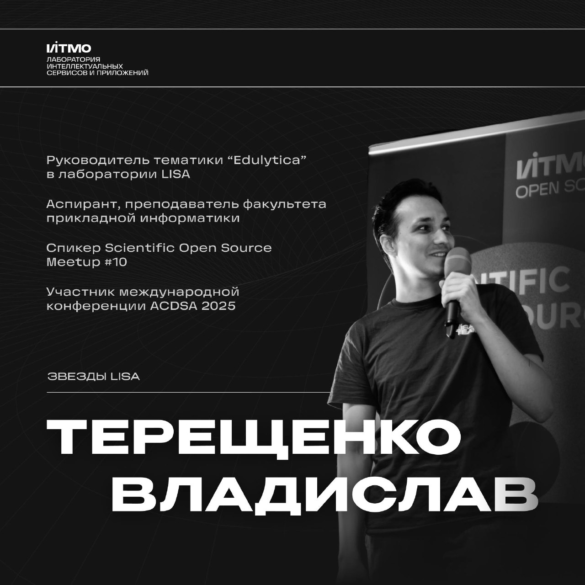
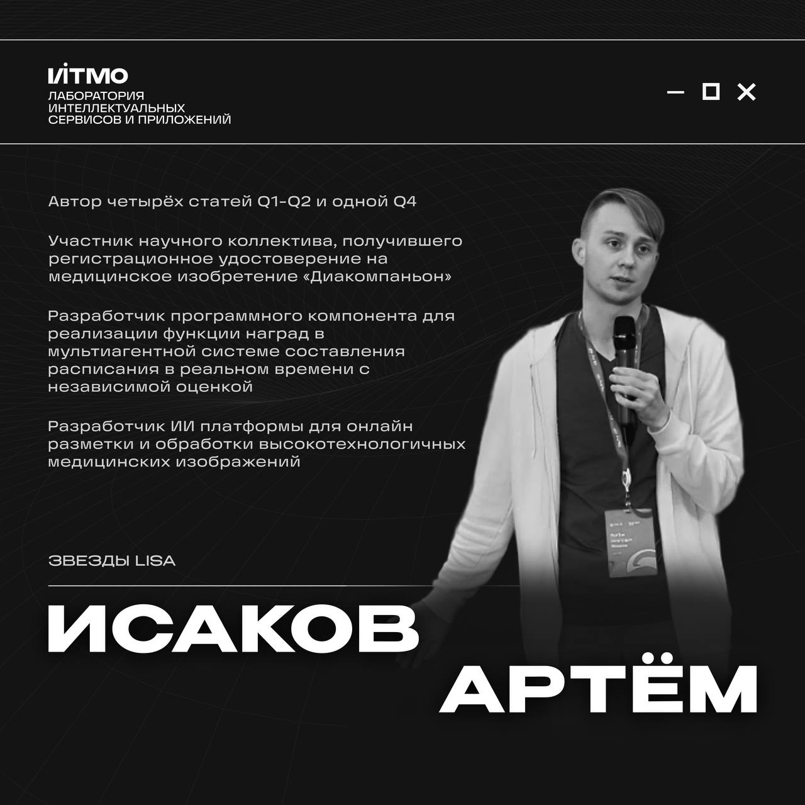

# ТОП сотрудники LISA за 2024-2025г.

## Балцат Константин

    

Работая в лаборатории с 2023 года, разработал инновационную систему, **которая анализирует текстовые диалоги, помогает 
людям лучше понимать друг друга, предсказывает кризисные моменты в отношениях и предлагает пути их решения**.

> Этот стартап стал не только его выпускной квалификационной работой в формате “Бизнес-тезис”, под научным руководством 
> Федорова Дмитрия Алексеевича, но и принес Константину звание лучшего выпускника ИТМО, а также победу во всероссийском 
> конкурсе Фонда содействия инновациям "Студенческий стартап" с грантовой поддержкой в размере 1 млн. ₽.

Позже Константин принял участие в форуме «Территория смыслов» и подал заявку на [конкурс «Росмолодёжь»](https://fadm.gov.ru/directions/grant/).
> Несмотря на то, что на заочном этапе он не одержал победу, на самом форуме он познакомился с экспертами, прошёл 
> консультации и вместо развлечений посвятил время мини-акселерационной программе.

Благодаря этому он смог переработать идею, улучшить проект и переделать заявку, которая принесла ему не просто победу, 
но еще и [грант в размере 800 тыс ₽ для дальнейшей реализации своего проекта](https://sun9-19.vkuserphoto.ru/s/v1/if2/NeAFeYNpsrm8dtJbycCRitM7W62Ppucn_nA2xvvwC4AkK1UWcVN8fpktPycytSThbfkLnUtsSrf29SNxHNV-9dG7.jpg?quality=95&as=32x23,48x34,72x51,108x77,160x114,240x171,360x256,480x341,540x384,640x455,720x512,1080x768,1280x910,1440x1024,2560x1820&from=bu&cs=2560x0).

🤝 Проект Константина был представлен на Академии ПМЭФ, где был удостоен поддержки в размере 1,5 млн ₽. Дополнили 
финансирование гранты от Immerse.Cloud и Yandex.Cloud с поддержкой в размере 40 тыс ₽ и 400 тыс ₽ соответственно.

💰 Стоит упомянуть и присужденные Константину стипендии:
- ПИШ 80 тыс ₽;
- ПГАС 35 тыс ₽/мес;
- Касперского 30 тыс ₽/мес;
- Потанина 20 тыс ₽/мес.

Суммарно грантовая поддержка разработки Константина составила более 3 млн ₽, стипендиальная — порядка 100 тыс ₽/мес , 
что является очень сильным и ярким результатом. Желаем Константину дальнейших успехов в разработке 🚀

## Перегородиев Данил
### ТОП по гранту "Код ИИ"

    

Данил Перегородиев, магистрант ФПИн, инженер LISA  — член команды разработчиков, [выигравшей конкурс грантов «Код 
Искусственный интеллект (очередь VII)»](https://fasie.ru/press/fund/kod-ai-7-results/) от Фонда содействия развитию 
малых форм предприятий в научно-технической сфере.

🥇 Среди [8 номинантов на грант, получивших от 2 млн ₽ до 10 млн ₽](https://fasie.ru/upload/docs/%D0%9F%D0%BE%D0%B1%D0%B5%D0%B4%D0%B8%D1%82%D0%B5%D0%BB%D0%B8_%D0%9A%D0%BE%D0%B4-%D0%98%D0%98%20(%D0%BE%D1%87%D0%B5%D1%80%D0%B5%D0%B4%D1%8C%20VII)%20(21.08.2024-23.09.2024).docx)
, максимальную финансовую поддержку получило только 4 команды, одна из которых – команда Данила!

Работа в проекте заключалась в создании [открытой библиотеки](https://github.com/AndreyKatsupeev/EITSynthAI) 
распознавания образов, полученных в результате томографических исследований, и генерации на их основе синтетических 
наборов данных, применяемых в задачах электроимпедансной томографии.

**📝 Коллектив рассчитывает, что:**
> Разработка данной библиотеки позволит создать прочную техническую базу для новых разработок на стыке медицины и ИИ, 
> а также усилить исследовательский интерес к электоимпедансной томографии - неинвазивному методу медицинской 
> визуализации, который используется для получения изображений электропроводности внутри тела на основе поверхностных 
> измерений.

На данный момент библиотека еще находится на стадии разработки, но большая часть функционала выполнена, а **первый этап 
работ уже прошел экспертную оценку** 🦾.

Помимо активной работы над созданием библиотеки, **Данил является стипендиатом Selectel в направлении “Разработка и 
IT-инженерия”**, для которой он предоставлял:
>☑️ **Мобильное приложение для удаленной работы с устройством электроимпедансной томографии** ([репозиторий](https://github.com/southrussian/EIT-Remote))
> Приложение позволяет профильным работникам в отделениях интенсивной терапии отслеживать картинку состояния легких 
> пациентов в реальном времени с учетом параметров вентиляции каждого легкого.

>☑️ **Объяснимая система распределения для мед учреждений** ([репозиторий](https://github.com/LISA-ITMO/ppo_resource_management))
> Она может быть применена для распределения пациентов (чье состояние здоровья меняется со временем, а число операционных 
> комнат и персонала ограничено) или в логистике (когда требуется срочная доставка, а машин для отгрузки тоже 
> ограниченное количество. **Эта разработка велась в рамках работы над магистерской диссертацией и трудоустройства в LISA.**

Мы желаем Данилу и его команде продолжать развиваться в сфере разработки и с нетерпением ждем финальной версии их 
открытой библиотеки! 🚀

## Гуйван Артем
### ТОП по грантам: Универсальный специалист

    

Артём Гуйван — молодой и инициативный разработчик LISA, который нашёл своё место в мире стартапов и искусственного 
интеллекта.

Спонтанно присоединившись к стартапу, Артём быстро погрузился в работу над проектом — ИИ-репетитором **Deeplit**:
> Цель проекта: помочь школьникам разбираться с математикой, проверяя решения задач и объясняя сложные моменты. 
> Особенность этого репетитора: он дообучен на заданиях из ЕГЭ, что делает его особенно полезным для подготовки к 
> экзаменам.

🏆 Разработка ИИ-репетитора принесла победу в гранте на вычислительные [ресурсы Yandex.Cloud в размере 400 тыс ₽](https://sun9-83.vkuserphoto.ru/s/v1/if2/wxLHs_Lv38ZlFcqSfzKxWhmn2ZAilO2je6GK_a0sR6oCrvu7J_N6evZ4pSv-rK7_kLdHqQnnaq-hEN15o61PXyqC.jpg?quality=95&as=32x21,48x32,72x48,108x72,160x107,240x160,360x240,480x320,540x360,640x426,720x480,1080x720,1280x853&from=bu&cs=1280x0)!

**Deeplit** также был представлен на [акселераторе ИТМО](https://accel.itmo.ru/) всего через две недели после активной 
работы Артема в команде других разработчиков. Команда успешно защитила проект, демонстрируя глубокое понимание 
технологии и её потенциала 🚀.

Помимо грантов, Артём принимал участие в проекте по воссозданию утраченных панно [Зубовского флигеля с помощью ИИ](https://m.sobaka.ru/entertainment/art/200182):
> В рамках этого проекта команда дообучала модели, экспериментировала с разными стратегиями, обсуждала с экспертами 
> возможные улучшения и реализации, а также занималась разметкой данных. Для восстановления панно использовались 
> современные SOTA нейросети, что позволило достичь впечатляющих результатов.

Подобные успехи в разноплановых проектах могут только восхищать! Команда LISA гордится своими сотрудниками и желаем 
Артему и дальше покорять научные вершины и находить пути решения прикладных задач индустрии! 🦾

## Терещенко Владислав
### ТОП по разработке и Open Sourсe

    

Терещенко Владислав — не только аспирант, преподаватель ФПИн, но и выросший за два года из сотрудника LISA 23-24 в 
руководителя тематики "Edulytica" ☄️

💻[Edulytica](https://github.com/aimclub/Edulytica):
> Фреймворк оценки текстовых результатов учебной и научной деятельности на основе больших языковых моделей, является 
> одним из самых популярных, активных и проработанных проектов нашей лаборатории.

Другим проектом, где Владислав является руководителем команды разработки, является проект **МФ ТИнТ SPARK**:
> Библиотека для анализа научных публикаций, которая на данный момент находится на этапе разработки.

**Владислав часто выступает и рассказывает о результатах, которых достигла его команда 🦾**

🔗 Например, недавно он выступал на [Scientific Open Source Meetup #10](https://vkvideo.ru/video-173944682_456239041), 
где Владислав рассказал об успехах своей команды в этом году, с темой доклада [“Как мы научили LLM-ассистента рецензировать научные работы студентов ИТМО: 
вновь о проекте Edulytica”](https://youtu.be/Eemi6Rr3k40?si=saGOl_IsN44c7K0T)!

Помимо научной и проектной деятельности Владислав является активным участником как Open Source сообщества LISA, так и 
всего [Университета ИТМО](https://opensource.itmo.ru/)! **На регулярных встречах Владислав:**
1. [️Делится](https://t.me/lisaitmo/191) обратной связью о качестве наших репозиториев;
2. [Рассказывает](https://vkvideo.ru/video-223020743_456239053) как об общепринятых подходах к разработке продуктов в 
индустрии, так и о процессах внутри своих команд.

Также Владислав в рамках проектов занимается научными исследованиями, о результатах которых докладывает на конференциях! 
Так, недавно, Владислав выступал с докладом на **международной конференции** [ACDSA 2025](https://acdsa.org/)!

## Исаков Артем
### От конференций и РИД до Q1

    

Артем Исаков, аспирант ФПИн, на протяжении двух лет комплексно развивал **проекты в рамках «Real Time eXplainable Multi-Agent Systems»**, 
начиная с кода, экспериментов и заканчивая презентацией результатов на конференциях, написании статей, регистрацией 
результатов интеллектуальной деятельности (РИД) и **получения регистрационного удостоверения на медицинское изобретение 
«Диакомпаньон»** ⬇️

Фреймворк, разработанный Артемом, это уникальное сочетание моделирующих и иерархических подходов в многоагентном 
обучении с подкреплением 💻:
> Артем и его команда предложили нестандартное решение, которое: позволило создать централизованный диспетчер задач, 
> решающий сколько агентов какого типа, когда и какую задачу будут выполнять, разработав гибкий протокол коммуникации 
> на графах, в основу которого легли векторные представления GPT.

Что говорит Артем о комплексной схеме своей работы:
> Обе конференции IDEAL 2024 (Q2) были "подготовительным" этапом для написания Q1 статьи в Technologies в рамках работы 
> над госзаданием. Статья ВАК и Q4 были отличным подспорьем в поиске актуальных направлений исследований и раннем 
> прототипировании решений. РИДы и статьи связаны одним госзаданием. Практические результаты статьей естественным 
> образом перешли в РИДЫ.

[Список статей](https://orcid.org/0000-0002-2938-0575):
1. Real-Time Scheduling with Independent Evaluators: Explainable Multi-Agent Approach (Q1, К1);
2. Personalized prediction of glycemic responses to food in women with diet-treated gestational diabetes: the role of 
the gut microbiota (Q1, К1);
3. Cooperative-Competitive Decision-Making in Resource Management: A Reinforcement Learning Perspective (Q2, К2);
4. Loss Function Role in Processing Sequences with Heavy-Tailed Distributions (Q2, К2);
5. Aspects of organizing game interactions among asymmetric agents using graph neural networks (Q4, К4);
6. Объяснимость поведения агентов в системах поддержки принятия клинических решений (ВАК).

Команда LISA поздравляет Артема и научного руководителя Наталью Гусарову с крутыми успехами и желает проектам 
дальнейшего развития! 🚀