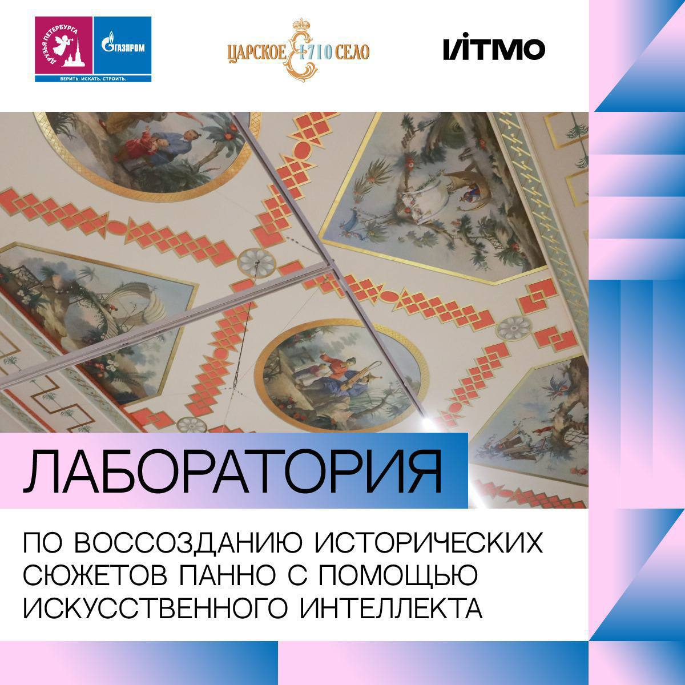
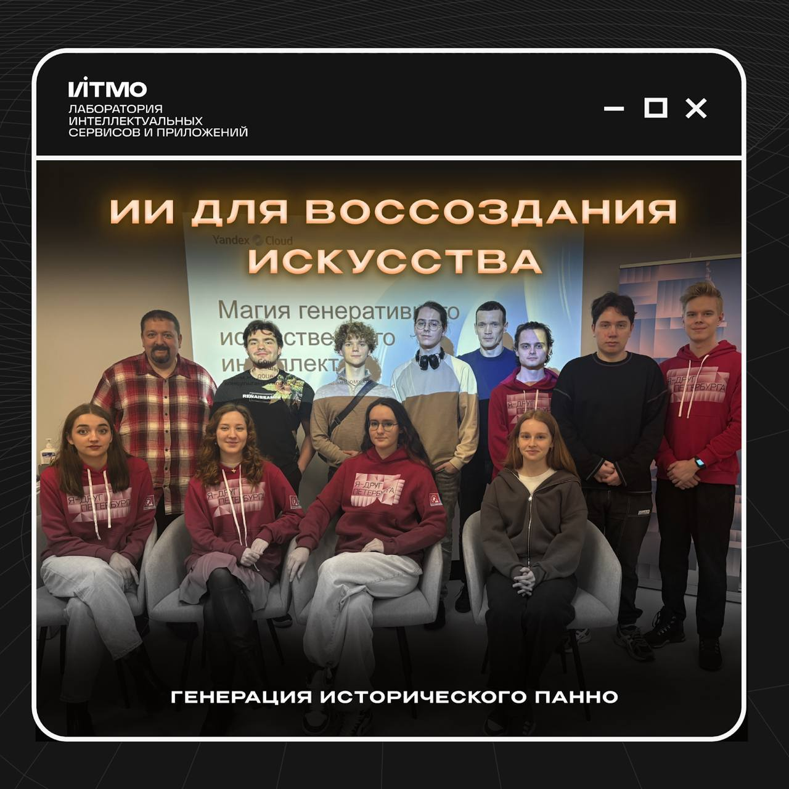
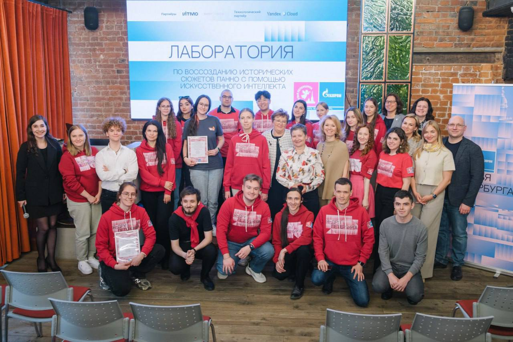

# Конкурс "Лаборатория по воссозданию исторических панно с помощью ИИ"

    

## Описание
"Лаборатория по воссозданию исторических панно с помощью ИИ" - уникальный проект, организованный ПАО «Газпром» [«Друзья 
Петербурга»](https://t.me/spb_friends) совместно с [ИТМО](https://t.me/itmoru), [ГМЗ «Царское Село»](https://t.me/tsarskoe_selo) 
и поддерживается [Центром технологий для общества Yandex Cloud](https://t.me/ycsocialtech), главная цель которого 
заключается в воссоздании исторических сюжетов для панно в Екатерининском дворце.

Во время Великой Отечественной войны интерьеры Зубовского флигеля были утеряны в результате пожара. Из 103 живописных 
полотен сохранились только 10. Однако у участников есть возможность сгенерировать оставшиеся 93 полотна с помощью 
нейросетевых технологий!

## Список участников
**Сотрудники лаборатории LISA:**
1. Гогуев Керам Магометович;
2. Гуйван Артём Русланович;
3. Дедкова Анастасия Викторовна;
4. Зайцева Мария Александровна;
5. Кондрашов Игорь Сергеевич;
6. Костенко Кирилл Денисович;
7. Миляев Дмитрий Дмитриевич;
8. Мурашов Никита Александрович.

**Участники из сообщества лаборатории:**
1. Бовина Полина Викторовна;
2. Ключникова Ульяна Юрьевна.

## Ход работы
### Программа мероприятий
✔️ 18 марта (Вт) — лекция от эксперта Yandex Cloud, Дмитрия Сошникова (очно);

✔️ 20 марта (Чт) — семинар от экспертов ИТМО:
«Искусственный интеллект в современном творчестве»;

✔️ 21 марта (Пт) — семинар от экспертов ИТМО:
«Что такое генеративный ИИ и какие задачи он поможет решить»;

✔️ 25 марта (Вт) — семинар от экспертов ИТМО:
«Углубленное ознакомление с технологиями ИИ и генеративных моделей»;

✔️ 26 марта (Ср) — общая установочная встреча;

✔️ 27 и 28 марта (Чт и Пт) — индивидуальные встречи с каждой группой для разработки концепций;

✔️ 2 апреля — презентации промежуточных результатов (групповая консультация с кураторами по записи)

✔️ 10 апреля — дообучение генеративных моделей (групповая консультация с кураторами по записи)

✔️ 17 апреля — обсуждение результатов, подведение итогов работы (групповая консультация с кураторами по записи)

✔️ 28 - 30 апреля — групповая презентация сгенерированных изображений экспертам ГМЗ «Царское Село», отбор лучших 
вариантов для дальнейшей реализации.

✔️ 13 мая - очный ФИНАЛ лаборатории. В рамках мероприятия запланированы презентации работ каждой команды и торжественная 
церемония награждения.

### Лекция о генеративном интеллекте от Яндекса!

    

В Университете ИТМО 18.03.25 прошла лекция Дмитрия Сошникова - [**"Магия генеративного интеллекта"**](https://disk.yandex.com/d/HIbvU-FjYxeYtQ).
Участники получили доступ к вычислительным ресурсам Yandex Cloud (Yandex GPT API, Yandex ART API, Yandex DataSphere). 
Это поможет добиться нашим коллегам больших успехов и внести вклад в восстановление исторического наследия!

Участники с интересом слушали лектора и остались под приятным впечатлением:
> Встреча с Дмитрием Сошниковым в ИТМО стала приятным сюрпризом. Даже сложные теоретические концепции он смог донести 
> доступно и понятно. Особенно полезно, когда лекция сопровождается примерами кода — а в этот раз их было несколько, 
> каждый под конкретную задачу. 
> 
> Проект очень интересен. Для меня генерация изображений — новое направление, так как раньше я работала только с 
> моделями генерации текста. Это также возможность «прикоснуться к вечному» и узнать больше об истории нашей страны, 
> участвуя в воссоздании утраченных объектов культурного наследия. Удивительно осознавать, что панно, созданные для 
> Екатерины II и утраченые в годы войны, могут «восстать из пепла», и я могу принять участие в этом процессе. У каждого 
> из нас есть шанс помочь реставраторам и внести хотя бы маленький вклад в эту огромную работу!"
> 
> Поделилась сотрудница лаборатории LISA **Анастасия Дедкова**

### Сотрудники LISA на экскурсии в Екатерининском дворце

    <video width="480" height="320" controls>
      <source src="images/ai_lab_excursion.mp4" type="video/mp4">
    </video>

### Реставрация в эпоху технологий: Искусство и нейросети объединяются!

    

Завершилась уникальная творческая лаборатория “AI ART LAB”, где история и искусство встречаются с инновациями!  52 
талантливых студента из ведущих вузов Москвы и Санкт-Петербурга объединились и воссоздали исторические панно с помощью 
искусственного интеллекта!

Двое участников лаборатории LISA были особо отмечены за выдающиеся успехи и вклад в проект:
- Дедкова Анастасия (бакалавр ФПИн)
- Костенко Кирилл (бакалавр ФПИн)

🚀 Мы гордимся их стремлением к новым знаниям и участием в столь значимом событии для культурного наследия, подробности 
в [посте](https://t.me/spb_friends/5108) “Друзья Петербурга”
