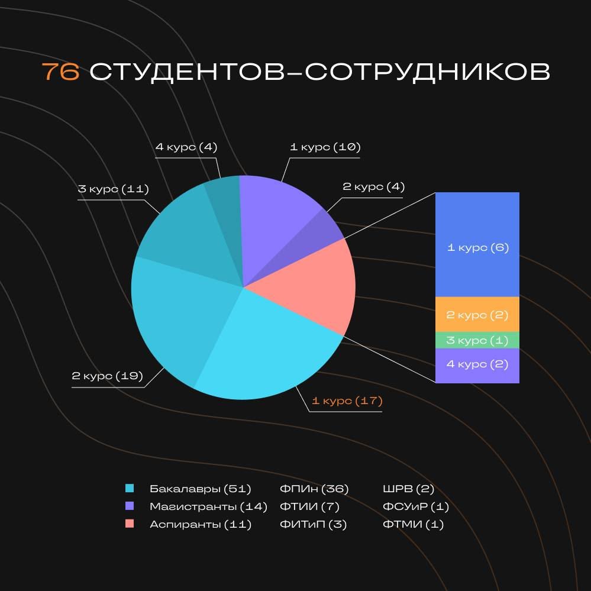
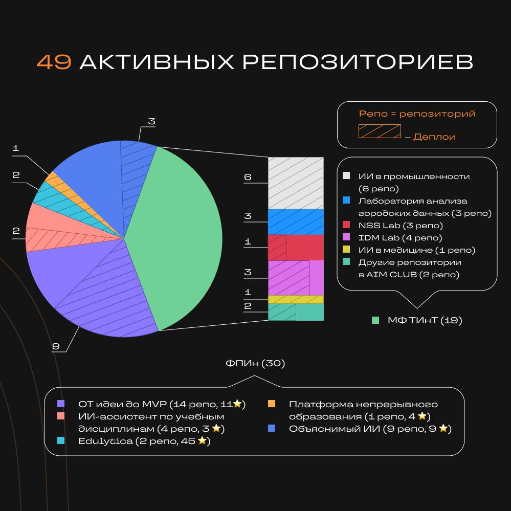
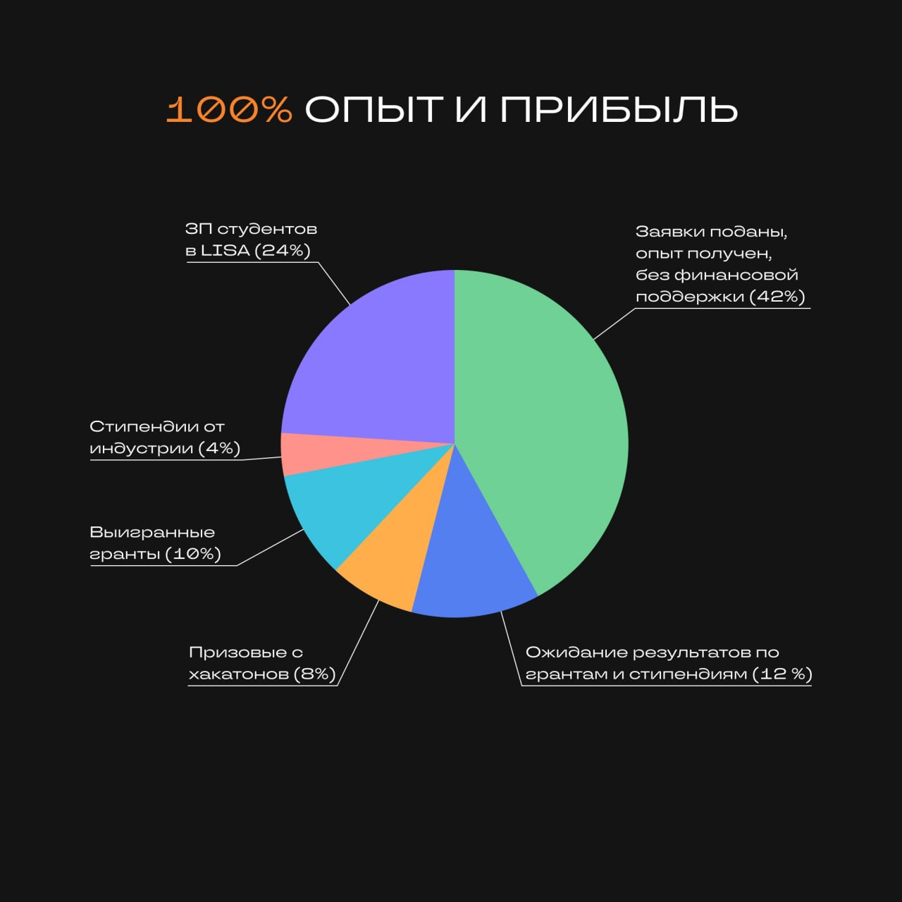
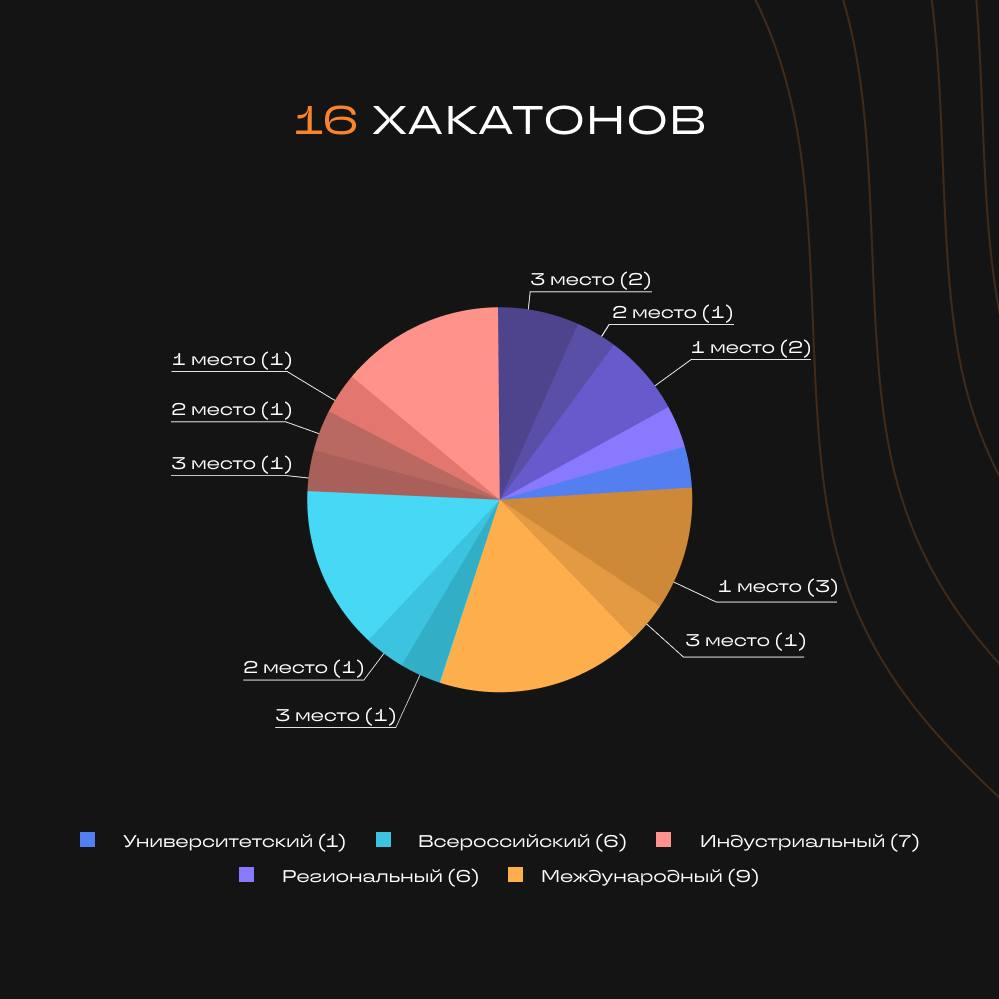
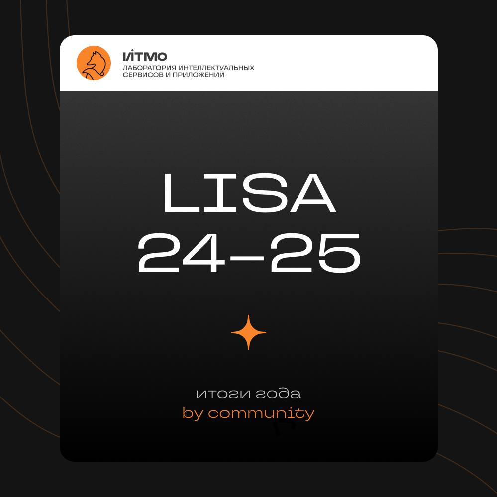
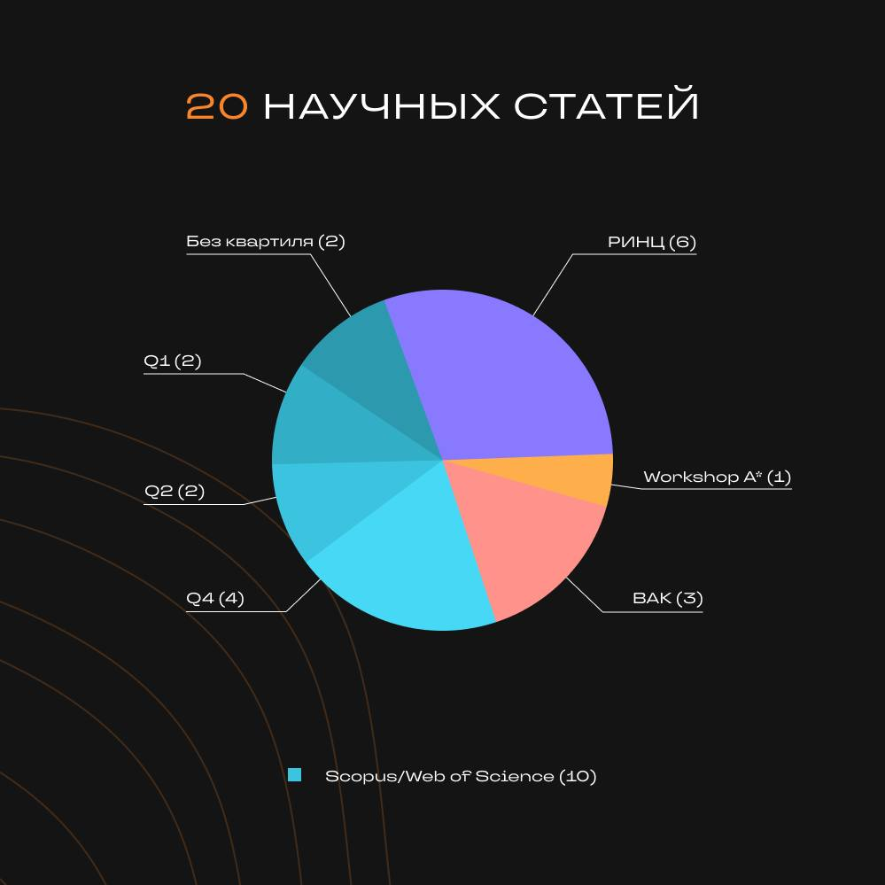
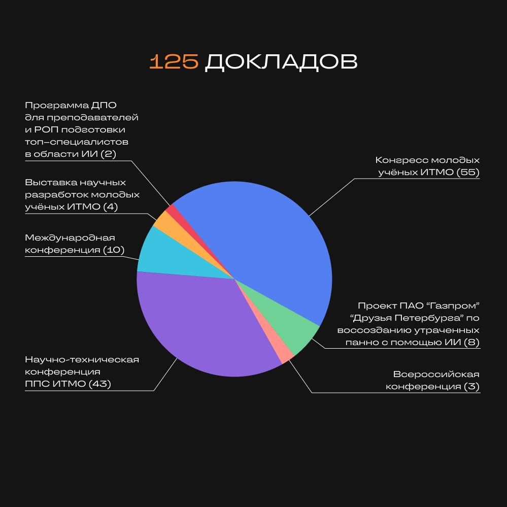
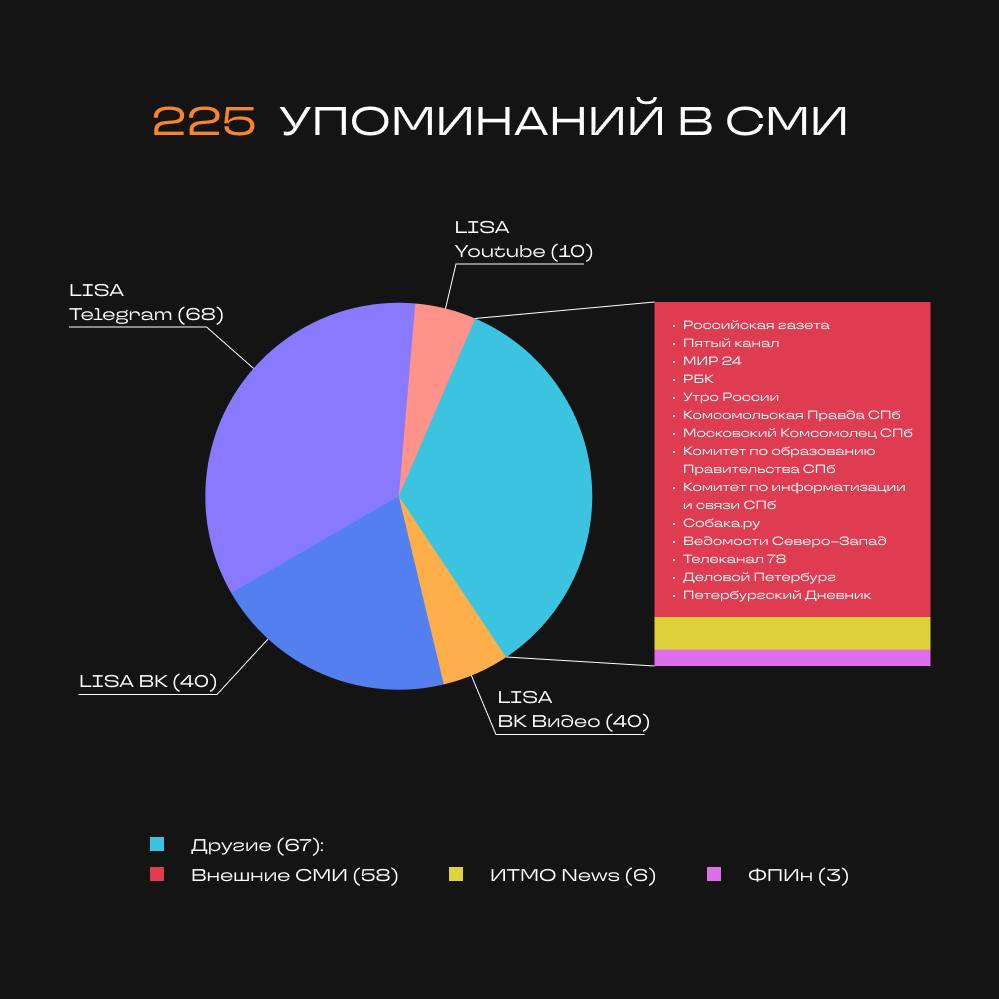
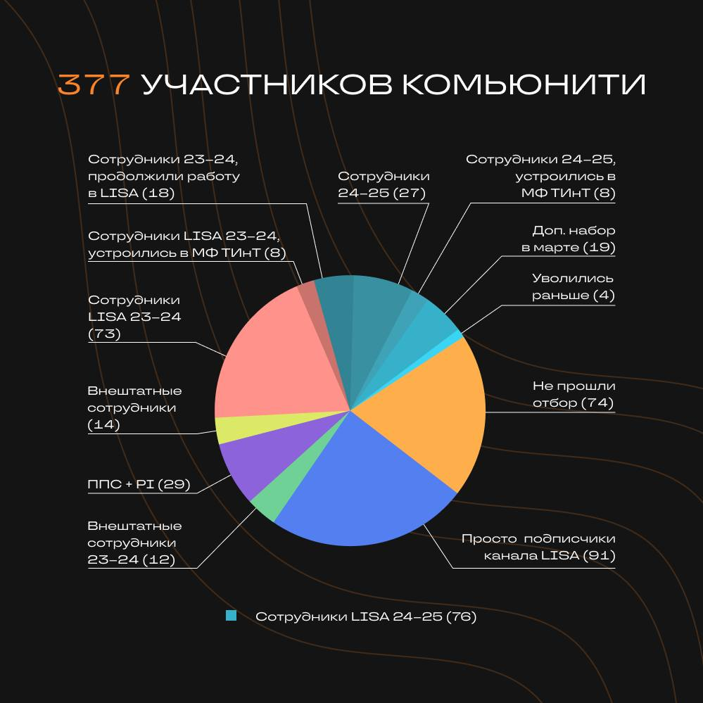

# LISA: Год роста, науки и студенческих побед

|   |   |         |
|----------------------------------------|---------------------------------------|--------------------------------------------------------|
|  |  |   |
|   |    |  |

Учебный год завершён, а значит — время подвести итоги работы LISA 🚀

Вот некоторые цифры, которые говорят сами за себя (подробнее с результатами можно ознакомиться в графиках) 🔥

## ⚡Команда: 
[Всего в лабораторию было подано 164 заявки](https://vk.com/wall-223020743_91) и трудоустроено 76 сотрудников

## ⚡Хакатоны, публикации и конференции
Вот несколько хакатонов, которые покорили наши сотрудники:
1. Цифровой прорыв. Сезон: искусственный интеллект»
2. Alfa Hack 2024
3. VTB API hackathon
4. Международный конкурс по искусственному интеллекту для молодежи

👉 20 научных статей, из них: 10 в журналах Scopus/Web of Science (Q1 – 2, Q2 – 2, Q4 – 4), workshop A*, 3 в ВАК и 6 
 в РИНЦ

👉 125 докладов, из них представлено на конференциях: 10 международных и 3 всероссийских, [43 на ППС](https://vk.com/wall-223020743_105) и [55 на КМУ](https://vk.com/wall-223020743_118)

## ⚡Гранты и стипендии
Студенты получили грантовую поддержку:
- 10 млн. рублей на команду в конкурсной программе «код-ИИ» Фонда Содействия Инновациям
- 2 млн. рублей в конкурсе «Студенческий Стартап» Фонда Содействия Инновациям
- 440 тыс. рублей на вычислительные ресурсы: Immerse Cloud, Yandex Cloud

🏆 На конкурсной основе выиграны различные стипендии:
Стипендии Президента и Правительства РФ, в том числе Selectel Career Wave, Стипендия им. К.А. Валиева для студентов, 
Конкурс стипендии СНО, Стипендия имени Евгения Касперского и Премия выдающихся выпускников национальной технологической 
олимпиады

## ⚡68 репозиториев в экосистеме LISA-ITMO
Как финальный результат разработки, было зарегистрировано 5 результатов интеллектуальной деятельности

## ⚡Помимо активной работы в лаборатории, студенты успевали проходить менторские программы и стажировки во внешних компаниях, таких как Glorax и МЕДСИ

## ⚡ Достижения лаборатории представлены на внешних СМИ по темам:
👉 [в петербургских школах контрольные работы проверяет нейросеть](https://rg.ru/2025/07/07/reg-szfo/rutinu-zabral-ii.html);

👉 [8 программистов LISA приняли активное участие в проекте по воссозданию утраченных панно Зубовского флигеля с 
помощью ИИ](https://www.sobaka.ru/entertainment/art/200182);

👉 [на базе LISA разработан и внедрен в прод чат-бот «Василий»](https://vk.com/wall438285231_12942);

👉 [экспертный разбор репозиториев LISA](https://vk.com/lisa.itmo?from=groups&w=wall-223020743_136) и т.д.

### Всё это — результат труда, идей и инициатив большого комьюнити. LISA — не просто лаборатория, это сообщество будущих исследователей и разработчиков, развивающихся в тематиках AI, ML и решении актуальных задач индустриальных партнеров ☄